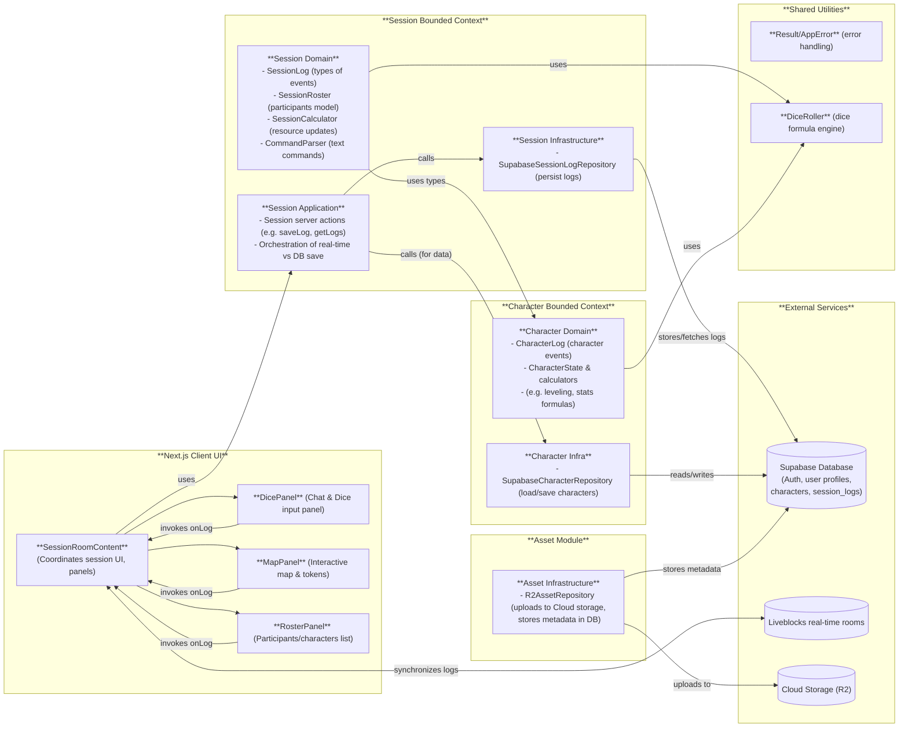

```mermaid
flowchart LR
    subgraph UI ["**Next.js Client UI**"]
        direction TB
        UIComp["**SessionRoomContent**<br/>(Coordinates session UI, panels)"]
        ChatDice["**DicePanel** (Chat & Dice input panel)"]
        MapPanel["**MapPanel** (Interactive map & tokens)"]
        RosterPanel["**RosterPanel** (Participants/characters list)"]
        
        UIComp --> ChatDice & MapPanel & RosterPanel
    end

    subgraph SessionBC ["**Session Bounded Context**"]
        direction TB
        SessionDomain["**Session Domain**<br/>- SessionLog (types of events)<br/>- SessionRoster (participants model)<br/>- SessionCalculator (resource updates)<br/>- CommandParser (text commands)"]
        SessionApp["**Session Application**<br/>- Session server actions (e.g. saveLog, getLogs)<br/>- Orchestration of real-time vs DB save"]
        SessionInfra["**Session Infrastructure**<br/>- SupabaseSessionLogRepository (persist logs)"]
    end

    subgraph CharacterBC ["**Character Bounded Context**"]
        direction TB
        CharacterDomain["**Character Domain**<br/>- CharacterLog (character events)<br/>- CharacterState & calculators<br/>- (e.g. leveling, stats formulas)"]
        CharacterInfra["**Character Infra**<br/>- SupabaseCharacterRepository (load/save characters)"]
    end

    subgraph AssetModule ["**Asset Module**"]
        AssetInfra["**Asset Infrastructure**<br/>- R2AssetRepository (uploads to Cloud storage,<br/> stores metadata in DB)"]
    end

    subgraph SharedUtils ["**Shared Utilities**"]
        SharedRes["**Result/AppError** (error handling)"]
        DiceLib["**DiceRoller** (dice formula engine)"]
    end

    subgraph External ["**External Services**"]
        SupabaseDB[("Supabase Database<br/>(Auth, user profiles,<br/>characters, session_logs)")]
        Liveblocks[("Liveblocks real-time rooms")]
        R2[("Cloud Storage (R2)")]
    end

    %% Relationships:
    UIComp -->|uses| SessionApp
    ChatDice -->|invokes onLog| UIComp
    MapPanel -->|invokes onLog| UIComp
    RosterPanel -->|invokes onLog| UIComp

    SessionApp -->|calls| SessionInfra
    SessionInfra -->|stores/fetches logs| SupabaseDB
    SessionApp -->|"calls (for data)"| CharacterInfra
    CharacterInfra -->|reads/writes| SupabaseDB

    SessionDomain -->|uses types| CharacterDomain
    SessionDomain -->|uses| DiceLib
    CharacterDomain -->|uses| DiceLib

    AssetInfra -->|uploads to| R2
    AssetInfra -->|stores metadata| SupabaseDB

    UIComp <-->|synchronizes logs| Liveblocks
```