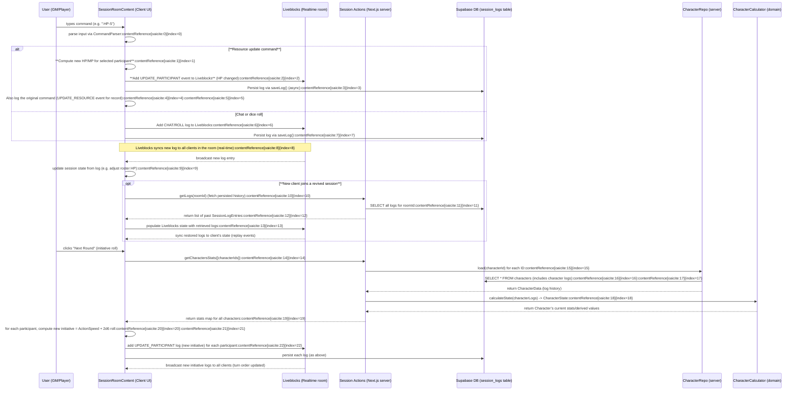

```mermaid
sequenceDiagram
    participant User as User (GM/Player)
    participant UI as SessionRoomContent (Client UI)
    participant Live as Liveblocks (Realtime room)
    participant SessAct as Session Actions (Next.js server)
    participant DB as Supabase DB (session_logs table)
    participant CharRepo as CharacterRepo (server)
    participant CharCalc as CharacterCalculator (domain)

    %% User triggers a resource update command in chat
    User ->> UI: types command (e.g. ":HP-5") 
    UI ->> UI: parse input via CommandParser:contentReference[oaicite:0]{index=0}
    alt **Resource update command**
        UI ->> UI: **Compute new HP/MP for selected participant**:contentReference[oaicite:1]{index=1}
        UI ->> Live: **Add UPDATE_PARTICIPANT event to Liveblocks** (HP changed):contentReference[oaicite:2]{index=2}
        UI ->> DB: Persist log via saveLog() (async):contentReference[oaicite:3]{index=3}
        UI ->> UI: Also log the original command (UPDATE_RESOURCE event for record):contentReference[oaicite:4]{index=4}:contentReference[oaicite:5]{index=5}
    else Chat or dice roll
        UI ->> Live: Add CHAT/ROLL log to Liveblocks:contentReference[oaicite:6]{index=6}
        UI ->> DB: Persist log via saveLog():contentReference[oaicite:7]{index=7}
    end
    Note over UI,Live: Liveblocks syncs new log to all clients in the room (real-time):contentReference[oaicite:8]{index=8}

    %% All clients update their local state from the new log
    Live -->> UI: broadcast new log entry
    UI ->> UI: update session state from log (e.g. adjust roster HP):contentReference[oaicite:9]{index=9}

    %% Later, another user joins the session (room was empty, no in-memory state)
    opt **New client joins a revived session**
        UI ->> SessAct: getLogs(roomId) (fetch persisted history):contentReference[oaicite:10]{index=10}
        SessAct ->> DB: SELECT all logs for roomId:contentReference[oaicite:11]{index=11}
        SessAct -->> UI: return list of past SessionLogEntries:contentReference[oaicite:12]{index=12}
        UI ->> Live: populate Liveblocks state with retrieved logs:contentReference[oaicite:13]{index=13}
        Live -->> UI: sync restored logs to client’s state (replay events)
    end

    %% During a session, session context needs character stats (cross-BC interaction)
    User ->> UI: clicks "Next Round" (initiative roll)
    UI ->> SessAct: getCharactersStats([characterIds]):contentReference[oaicite:14]{index=14}
    SessAct ->> CharRepo: load(characterId) for each ID:contentReference[oaicite:15]{index=15}
    CharRepo ->> DB: SELECT * FROM characters (includes character logs):contentReference[oaicite:16]{index=16}:contentReference[oaicite:17]{index=17}
    CharRepo -->> SessAct: return CharacterData (log history)
    SessAct ->> CharCalc: calculateState(characterLogs) -> CharacterState:contentReference[oaicite:18]{index=18}
    CharCalc -->> SessAct: return Character’s current stats/derived values
    SessAct -->> UI: return stats map for all characters:contentReference[oaicite:19]{index=19}
    UI ->> UI: for each participant, compute new initiative = ActionSpeed + 2d6 roll:contentReference[oaicite:20]{index=20}:contentReference[oaicite:21]{index=21}
    UI ->> Live: add UPDATE_PARTICIPANT log (new initiative) for each participant:contentReference[oaicite:22]{index=22}
    UI ->> DB: persist each log (as above)
    Live -->> UI: broadcast new initiative logs to all clients (turn order updated)
```